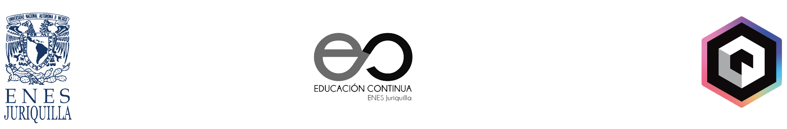
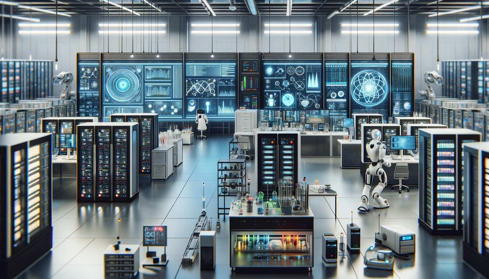

# Inteligencia Artificial y Aprendizaje Automático

---

**Fecha:** 27 de febrero a 21 marzo de 2024  

**Responsable:** Dr. Ulises Olivares Pinto  

**Auxiliares:** Alan Poisot Palacios, Joshelyn Yanori Mendoza Alfaro  

## Objetivo General
Desarrollar una comprensión profunda y aplicada de los principios y técnicas fundamentales de la inteligencia artificial y el aprendizaje profundo, capacitando a los participantes para diseñar, implementar y evaluar soluciones avanzadas en diversos contextos y problemas reales.

## Objetivos Específicos
- Entender los principios fundamentales de la IA y el aprendizaje profundo.
- Dominar el uso de redes neuronales en aplicaciones prácticas.
- Aplicar aprendizaje profundo a la visión por computadora y al NLP.
- Experimentar con la creación de datos mediante modelado generativo.
- Implementar aprendizaje por refuerzo para la toma de decisiones autónoma.
- Completar proyectos que integren teoría y práctica de IA.
- Seguir las tendencias actuales y emergentes en IA.
- Considerar la ética en el desarrollo y aplicación de la IA.

## **Modalidad:** 
>Presencial  
## **Prerrequisitos:** 
+ Computadora personal con acceso a internet
+ Cuenta de Gmail
+ Conocimientos básicos de programación.

## Temario

| Sesiones    | Tema                                                               | Subtemas                                                                                                                                                   | Material de Consulta                                                                                                     | Ejercicios y Demostraciones|
|-------------|--------------------------------------------------------------------|-------------------------------------------------------------------------------------------------------------------------------------------------------------|---------------------------------------------------------------------------------------------------------------------------|------------|
| Sesión 1    | Introducción a la IA y Aprendizaje Profundo                        | <ul><li>Historia y Fundamentos de la IA</li><li>Diferencias entre ML y AP</li><li>Aplicaciones y Casos de Éxito</li></ul>                                    | ["Artificial Intelligence: A Modern Approach" por Stuart Russell y Peter Norvig](https://www.amazon.com/Artificial-Intelligence-Modern-Approach-3rd/dp/0136042597) |   <ul><li>[Demo 1: Modelado generativo](https://colab.research.google.com/drive/1UXRuaYiXz6_S0KqZj2576AyQvpIES0UE?usp=sharing)</li><li>[Demo 2: YOLO](https://colab.research.google.com/drive/1oUqRgH4FXOQDDOx72Z1Pk7xwZrT0nSUq?usp=sharing)</li><li>[Demo 3:Reconocimiento de emociones]([https://drive.google.com/file/d/1Y3g8LIlzQOJ4OfiAKPJ9aAKqFrpHdNZj/view?usp=sharing](https://drive.google.com/file/d/1Y3g8LIlzQOJ4OfiAKPJ9aAKqFrpHdNZj/view?usp=sharing))</li></ul>  |
| Sesión 2    | Fundamentos de Redes Neuronales                                    | <ul><li>Conceptos Básicos de ANNs</li><li>Arquitecturas de Redes</li><li>Entrenamiento de Redes Neuronales</li></ul>                                          | ["Deep Learning" por Ian Goodfellow, Yoshua Bengio, y Aaron Courville](https://www.deeplearningbook.org/)                |            |
| Sesión 3    | Redes Neuronales Convolucionales (CNN)                             | <ul><li>Fundamentos y Arquitectura de CNNs</li><li>Aplicaciones en Visión por Computadora</li><li>Práctica con CNNs</li></ul>                                 | ["Convolutional Neural Networks for Visual Recognition" - Stanford University](http://cs231n.stanford.edu/)               |            |
| Sesión 4    | Redes Neuronales Recurrentes (RNN) y LSTMs                         | <ul><li>Arquitectura y Aplicaciones de RNNs y LSTMs</li><li>Procesamiento de Secuencias</li><li>Práctica con RNNs</li></ul>                                   | ["Understanding LSTM Networks" - Colah's Blog](http://colah.github.io/posts/2015-08-Understanding-LSTMs/)                |            |
| Sesión 5    | Modelado Generativo y GANs                                         | <ul><li>Introducción a Autoencoders y VAEs</li><li>Fundamentos de GANs</li><li>Práctica con GANs</li></ul>                                                     | ["Generative Adversarial Nets" por Goodfellow et al.](https://arxiv.org/abs/1406.2661)                                    |            |
| Sesión 6    | Aprendizaje Profundo en Procesamiento de Lenguaje Natural (NLP)    | <ul><li>Introducción al NLP con AP</li><li>Modelos de Lenguaje y Transformers</li><li>Práctica con modelos de lenguaje</li></ul>                              | ["Natural Language Processing with Python" - Bird, Klein, y Loper](https://www.nltk.org/book/)                            |            |
| Sesión 7    | Aprendizaje por Refuerzo                                           | <ul><li>Conceptos de Aprendizaje por Refuerzo</li><li>Algoritmos: Q-learning y Policy Gradients</li><li>Práctica con AP</li></ul>                             | ["Reinforcement Learning: An Introduction" por Richard S. Sutton y Andrew G. Barto](http://incompleteideas.net/book/the-book.html) |            |
| Sesión 8    | Proyecto y Discusiones Finales                                     | <ul><li>Presentación de Proyectos Finales</li><li>Retos y Futuro de la IA y AP</li></ul>                                                                      | ["The Master Algorithm" por Pedro Domingos](https://www.amazon.com/Master-Algorithm-Ultimate-Learning-Machine/dp/0465065708) y artículos relevantes sobre las tendencias actuales y emergentes en IA |            |

#### Última modificación: 27 de febrero de 2024
